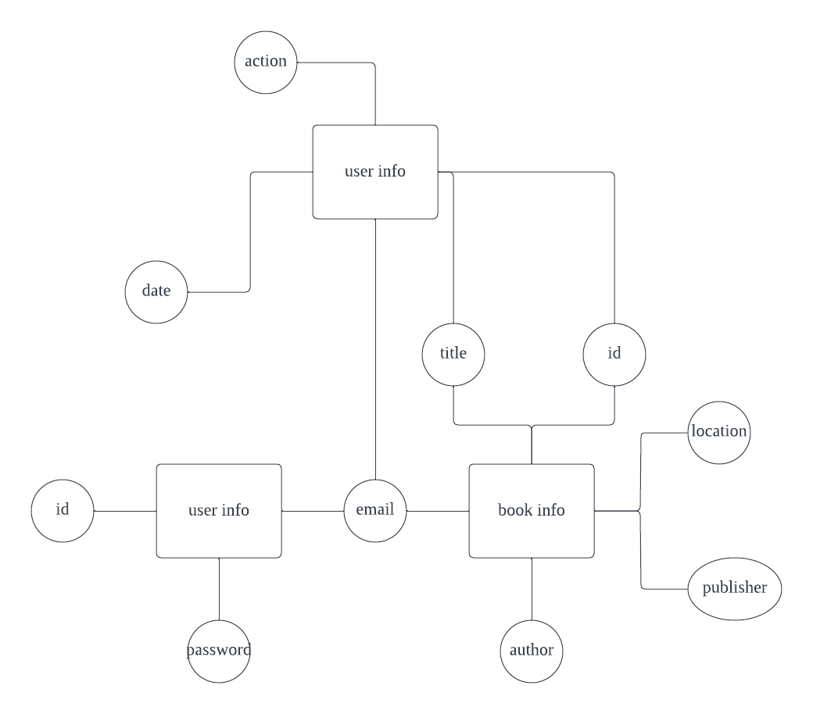
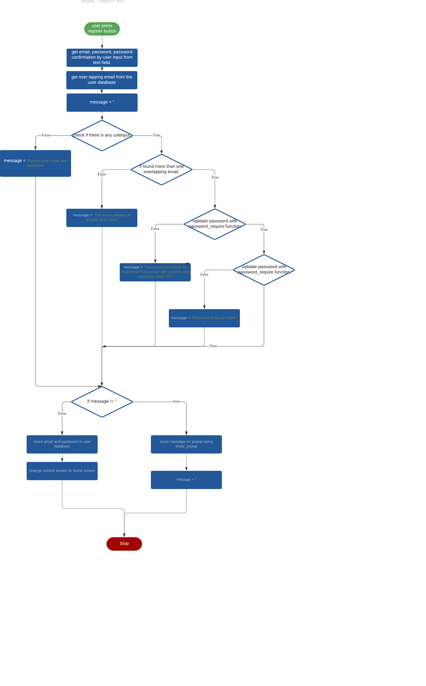

# Unit 3 Project: Book App

## Criteria A: Planning

## Problem definition(Client identification)

My client is a student studying in a boarding school. He is a book worm and has a huge number of books. The issue that he
is currently facing is that he cannot organize his book anymore. He have tried many other app but none of them have met his need.
As a boarding school student he needed a function that manages where his books are located. He wanted to know whethere the book is in his house or in school. There for he needed an app that has a function that could manage book info such as title,author,publisher and its current location.


## Proposed Solution

Considering my clients requirements, an adequate solution would include a localized computer program with a GUI(
Graphical User Interface) that can store data into a database. Python would be an adequate programming language for the
solution as it is open source, it is mature and supported in multiple platforms (platform-independent) including macOS,
Windows, Linux.[^2]For the database, SQLite would be an adequate solution as it is an embedded, serverless relational
database which means the program and the database can be both localized. 
As for the GUI, KivyMD is chosen for its elegant and simpleness. This GUI framework uses is structured in
object-oriented format and makes the development easy[^4].

[^2]: Python Geeks. “Advantages of Python: Disadvantages of Python.” Python Geeks, 26 June
2021, https://pythongeeks.org/advantages-disadvantages-of-python/.
[^3]: S, Ravikiran A. “What Is Sqlite? and When to Use It?” *Simplilearn.com*, Simplilearn, 16 Feb.
2023, https://www.simplilearn.com/tutorials/sql-tutorial/what-is-sqlite.
[^4]: Gupta, Kaustubh. “What Is KivyMD: Creating Android Machine Learning Apps Using KivyMD.” *Analytics Vidhya*, 6 July
2021, https://www.analyticsvidhya.com/blog/2021/06/creating-android-ml-app-kivymd/#:~:text=KivyMD%20is%20built%20on%20the.

**Design statement**

I will design a Python application running on the KivyMD GUI framework which stores data in an SQLite database for
Gentaro. This application lets Gentaro to add a new boook into the database with the information of title,author,publisher and location.
He will be acle to delete books from the database and all these action will be recorded and will be able to review. 
The app will have a searching funtion to allow you to search a book from multiple search conditions(title,author,publisher and location).
All of the action will be individual for users since all content will be under hashed login system.

It will take approximately 1 month to complete and will be evaluated according to criteria below:

## Success Criteria

1. Users action are independent due to a encrypted login system.
2. The program will allow user input of book information(title,author,publisher and location) and these will be saved in a database.
3. The app has a function to delete book from the database.
4. Users are able to search book from their own database.
5. Users can review their add, delete action.
6. The app shows all the book that the user owns as a table in home screen.

# Criteria B: Design

## System Diagram


System diagram

## Data Storage



ER diagram

## UML Diagram


UML Diagram

## Wireframe


Wireframe

## Record of Tasks

| Task No | Planned Action                                           | Planned Outcome                                                                                                                    | Time estimate | Target completion date | Criterion |
|---------|----------------------------------------------------------|------------------------------------------------------------------------------------------------------------------------------------|---------------|------------------------|-----------|
| 1       | Planning: Meet with client                      | Find out the issue and find out a possible solution through interview                                                                                       | 10 min         | Feb 8                  | A         |
| 2       | Planning: second meeting with client| define problem and propose solution                                                                      | 30min          | Feb 15                 | A         |
| 6       | Coding the structure of the database                     | Create the database for user and book information                                                                                          | 10min         | Mar 4                  | C         |
| 7       | create database_handler                            | Add a function to the database handler to managage the addition action for the user database and bookinfo database                                     | 10min         | Mar 4                  | C         |
| 8       | Coding the Login and registration Screen and function                 | Add a function of encrypted sign up and login system. Create the user interface for both screen.                        | 30 min        | Mar 4                  | C         |
| 9       | Coding the Home screen                                | Create the MainScreen                                                                          | 30 min        | Mar 4                  | C         |
| 10      | Coding the MDDataTable                                   | Add a MDDataTable in the HomeScreen and make connection with the book                                                                                    | 15 min        | Mar 4                  | C         |
| 11      | Create AddScreen| Create the user interface of the AddScreen                               | 5 min         | Mar 4                  | C         |
| 12      | Create the function for AddScreen | Create funtion for user to add new book info in the bookinfo db.| 40 min        | Mar 4                  | C         |
| 13      | Create SearchScreen                         | Create the SearchScreeen                                                  | 40 min        | Mar 4                  | C         |
| 14      | Coding the search function                               | Create function to Search function.                                                                  | 5 min         | Mar 4                  | C         |
| | | |
| 23      | Creating System Diagram                                  | To have system diagram finished                                                                                                    | 30 min        | Mar 24                  | B         |
| 24      | Creating UML Diagram                                     | To have the UML diagram finished                                                                                                   | 30 min        | Mar 24                  | B         |
| 25      | Creating ER Diagram                                      | To have the ER diagram finished                                                                                                    | 30 min        | Mar 24                  | B         |
| 26      | Creating Flow Diagrams                                   | To have the  flow diagrams finished                                                                                                | 30 min        | Mar 24                  | B         |
| 27      | Completing Development Part of Criteria C                | To have interesting parts of my code documented properly                                                                           | 2 hr          | Mar 3                  | C         |
| 28      | Coding: Beautifying Graphical User Interface             | To make the interface more user-friendly and easily understandable                                                                 | 2 hr          | Mar 3                  | C         |
| 29      | Filling Computational Thinking                           | To have the Computational Thinking part of Criteria C of the README file finished                                                  | 1 hr          | Mar 6                  | C         |
| 30      | Creating Test Plan                                       | To have a test plan created for confirming if the application works to standard                                                    | 1.5 hr        | Mar 7                  | C         |
| 31      | Consolidating and commenting code                        | To have the code finalized and organized for easy-understanding                                                                    | 1 hr          | Mar 7                  | C         |
| 32      | Beautifying README file                                  | To have README file consolidated and completed                                                                                     | 20 min        | Mar 7                  | B         |
| 33      | Finish video for Criteria D                              | Video evidence of all the success criteria functioning and working within the developed application                               | 10 min        | Mar 24                  | D         |

## Flow Diagrams

#### Login


#### Register



#### Add


#### Delete


## Test Plan

| Type                | Description                 | Process                                                                                                                                                                                                                                                                                      | Anticipated Outcome                                                                                                                                                                                                                                                                                                                                                                                                                                                               |
|---------------------|-----------------------------|----------------------------------------------------------------------------------------------------------------------------------------------------------------------------------------------------------------------------------------------------------------------------------------------|-----------------------------------------------------------------------------------------------------------------------------------------------------------------------------------------------------------------------------------------------------------------------------------------------------------------------------------------------------------------------------------------------------------------------------------------------------------------------------------|
| Unit Testing        | Registration           | 1. Run main.py file <br />2. Click the Register button on the application screen <br />3. Input the appropriate information in each textfield following the hint text<br /> 4. Click Register                                                                                         | when the button is pressed error code is created depending on what stage is the correctness of userinput are. The error is prioritized in the order of overlapping email, not matching the password requirements and the mismatch of password confirmation.|
| Unit Testing        | Login                  | 1. Run main.py file <br />2. Input the wrong information in each textfield. Click Login                                                                                                                                                         | After clicking the login, if the pair of email and password didn't exist in the database show an error message, other wise the user will go to home screen.|
| Unit Testing        | Search Book            | 1. Run main.py file <br />2. Login and go to home screen. Some books must be stored in the data base at this point.<br />3. Enter something that exist in the database into the author text field. Leave the other blank. Click search.                                                                                                          | If the table shows all item that includes have the same author.|
| Unit Testing        | Add Book               | 1. Run main.py file <br />2. Login with previously registered credentials <br />3. From Home screen go to Add screen. Put input on some text field. click update. Go to Home screen from Home button.| if the home screen table shows the added book.
| Unit Testing        | delete Book               | 1. Run main.py file <br />2. Login with previously registered credentials <br />3. From Home screen go to edit screen check multiple rows to delete. click delete. Go to Home| if the home screen table stop showing shows the deleted book.
| Unit Testing        | Edit history               | 1. Run main.py file <br />2. Login with previously registered credentials <br />3. Make sure you have done adding and deleting before. From Home screen go to edit screen go to show history.| if the table show the past action you made.

# Criteria C: Development

## Existing Tools

| Software/Development Tools | Coding Structure Tools       | Libraries  |
|----------------------------|------------------------------|------------|
| PyCharm                    | OOP Structures(Classes)      | Kivymd.app |
| Python                     | SQL requests                 | Passlib    |
| SQLite                     | Databases                    | sqlalchemy |
| KivyMD                     | Encryption                   | kivymd.uix |

## List of techniques used

1. For loops
2. if statements
3. Password Hashing
4. Interacting with Databases
5. Text Formatting

## Computational Thinking

#### Decomposition

Decomposition in computational thinking means breaking down complex problems into smaller parts for easier analysis and solution. It is a structured methodology that allows for identifying patterns, relationships, and dependencies. It is commonly used in software development but can be applied to various problem-solving situations. In my project I applied this methods by breaking down my creation process bt every function. After creating each function I added all into the app. By using this method it was very easy to solve errors because you can easily find and solve it because the function 
was independent.

##### Main Function

###### database handler
This is my database handler. There is a function called insert_1 and insert_2 in it.
insert_1 is for adding in user information in the users table. insert_2 is for adding in the book information into book_info table.
```.py
class database_handler:

    def __init__(self, namedb:str):
        self.connection = sqlite3.connect(namedb)
        self.cursor = self.connection.cursor()

    def search(self,query):
        result = self.cursor.execute(query).fetchall()
        return result

    def run_save(self,query):
        self.cursor.execute(query)
        self.connection.commit()

    def create_tables(self):
        query1 = f"""CREATE TABLE if not exists users(
            id INTEGER PRIMARY KEY,
            email text NOT NULL unique,
            password text NOT NULL
        )"""
        self.run_query(query1)

    def insert_1(self,email,password):
        query = f'INSERT INTO users(email,password) values ("{email}","{password}")'
        self.run_query(query)
        self.close()

    def insert_2(self,email,title,author,publisher,location):
        query = f'INSERT INTO book_info(email,title,author,publisher,location) values ("{email}","{title}","{author}","{publisher}","{location}")'
        self.run_query(query)
        self.close()

    def insert_3(self,email,title,action,id):
        date = datetime.datetime.now()
        query = f'INSERT INTO history(email,title,action,id,date) values ("{email}","{title}","{action}","{id}","{date}")'
        self.run_query(query)
        self.close()

    def run_query(self,query:str):
        self.cursor.execute(query)
        self.connection.commit()

    def close(self):
        self.connection.close()
```
##### Log in
This is my Login Screen. This connects to the users database. The try_login function will will conduct the login process by checking if there is a pair of the correct email adress and password. If the inputs are wrong the show_popup function will show a error message using a popup.
```.py
class LoginScreen(MDScreen):
    def show_popup(self):
        dialog = MDDialog(
            title="Error:",
            text="You have entered wrong email or password.",
            buttons=[
                MDFlatButton(
                    text="Close", on_release=lambda *args: dialog.dismiss()
                )
            ],
        )
        dialog.open()

    def try_login(self):
        db = database_handler("BookApp.db")
        email = self.ids.email.text
        passwd = self.ids.passwd.text
        print(hash(passwd))
        query = f"SELECT * from users where email = '{email}' and password = '{hash(passwd)}'"
        a = db.search(query)
        print(a)
        if len(a) > 0:
            HomeScreen.email = email
            self.parent.current = 'HomeScreen'

        else:
            self.show_popup()
        db.close()
```
##### sign up
This class manages the sign up function. It will add new user email and password in the users database with the try_register function.
It asks for your email password and password confirmation. It has a input validation function and will show error message through the show_popup function. It shows different error message based on which step of error you are on. The steps are 
1. You don't have any imput. 
2. Your email is already used. 
3. The password is not matching the requirments(validated by the password_require function). 
4. If the password confirmation does not match the original one.

```.py
class SignupScreen(MDScreen):
    def show_popup(self,error):
        dialog = MDDialog(
            title="Error:",
            text= error,
            buttons=[
                MDFlatButton(
                    text="Close", on_release=lambda *args: dialog.dismiss()
                )
            ],
        )
        dialog.open()

    def password_require(self,password):
        print('start')
        password = str(password)
        number = False
        upper = False
        length = False
        for i in password:
            if i.isdigit():
                number = True
            if i.isupper():
                upper = True
        if len(password) > 7:
            length = True
        print(number,upper,length)
        if number == False or upper == False or length == False:
            return 'invalid'

    def try_register(self):
        db = database_handler("BookApp.db")
        email = self.ids.email.text
        passwd = self.ids.passwd.text
        passwd_confirm = self.ids.passwd_confirm.text
        print(email,passwd,passwd_confirm)
        query = f"SELECT * from users where email = '{email}'"
        a = db.search(query)
        message = ''
        if len(email) < 1 or len(passwd) < 1:
            message = 'Please enter email and password'

        elif len(a) > 0:
            message = 'This email address is already been used'

        elif self.password_require(passwd) == 'invalid':
            message = 'The password should be more than 8 character with number and uppercase letter in it'

        elif passwd != passwd_confirm:
            message = 'Password does not match'


        if message != '':
            self.show_popup(message)
            message = ''
        else:
            db = database_handler('BookApp.db')
            db.insert_1(email,hash(passwd))
            HomeScreen.email = email

            self.parent.current = 'HomeScreen'
            print('register successful')


        db.close()
```

##### Home Screen
```.py
class HomeScreen(MDScreen):
    email = None
```
When login or register is successful it gives the current user email to the home screen.
```.py
    def get_list(email):
        db = database_handler("BookApp.db")
        query = f"SELECT title,author,publisher,location from book_info where email = '{email}'"
        a = db.search(query)
        return a

```
This get_list function will get all information of the user owned book.
```.py
    def on_pre_enter(self):
        data = HomeScreen.get_list(self.email)
        self.current = self.email
        print(self.email)
        # before the screen is created, this code is run
        self.data_table = MDDataTable(
            size_hint=(.8, .65),
            pos_hint={'center_x': .5, 'center_y': .4},
            use_pagination=False,
            pagination_menu_height=40,
            check=False,
            rows_num = 10,
            # Title of the columns
            column_data=[
                         ("Title", 60),
                         ("Author", 60),
                         ("Publisher", 60),
                         ("Location", 60),
                         ],
            row_data=data


        )
        self.add_widget(self.data_table)
```
on_pre_enter function creates a MDDataTable before the Screen is shown . The table will be showing all the information from the get_list function above.

##### Add Screen
In the adding screen user are allowed to add new books in the database 
The find_last function finds the last books id that was added in the database. 
The book id will be recorded in history.
```.py
class AddScreen(MDScreen):
    def find_last(self):
        print('find last')
        db = database_handler('BookApp.db')
        query_id = f"SELECT id from book_info ORDER BY id DESC LIMIT 1;"
        id = db.search(query_id)
        print(f'id is {id[0][0]}')
        db.close()
        return id[0][0]
    def update(self):
        email = HomeScreen.email
        title = self.ids.title.text
        author = self.ids.author.text
        publisher = self.ids.publisher.text
        location = self.ids.location.text
        print(f'general info {email,title,author,publisher}')
        db = database_handler('BookApp.db')
        db.insert_2(email, title, author, publisher,location)
        action = 'Add'
        id = self.find_last()
        EditScreen.history(self,email,title,action,id)
        db.close()

```
##### search screen
```.py
class SearchScreen(MDScreen):
        def search_list(self):
        email = HomeScreen.email
        title = self.ids.title.text
        author = self.ids.author.text
        publisher = self.ids.publisher.text
        location = self.ids.location.text
        search_result = []
        db = database_handler("BookApp.db")
        query = f"SELECT id,title,author,publisher,location from book_info where email = '{email}'"
        a = db.search(query)
        print(a)
        print(f'searched by {title,author,publisher,location}')
        for i in a:
            print(i)
            if i[1] == title or title == '':
                if i[2] == author or author == '':
                    if i[3] == publisher or publisher == '':
                        if i[4] == location or location == '':
                            print('appending')
                            search_result.append(i)
        print(search_result)
        self.show(search_result)
```
By adding title == '' in the for loop allows users to leave a empty blank in the textbox.
```.py
    def show(self,data):
            self.ids.Searchbook.text = 'Result'
            # before the screen is created, this code is run
            self.data_table = MDDataTable(
                size_hint=(.8, .7),
                pos_hint={'center_x': .5, 'center_y': .49},
                use_pagination=False,
                pagination_menu_height=40,
                #            check=True,
                rows_num=10,
                # Title of the columns
                column_data=[
                    ("Title", 60),
                    ("Author", 60),
                    ("Publisher", 60),
                    ("Location", 60),
                ],
                row_data=data

            )
            self.add_widget(self.data_table)
```
##### Edit Screen
```.py
class EditScreen(MDScreen):
    def history(self,email,title,action,id):

        db = database_handler('BookApp.db')

        print(f'last id is {id}')
        db.insert_3(email,title,action,id)
        db.close()
```
Add action into history database
```.py
    def on_pre_enter(self):
        self.data = HomeScreen.get_list(HomeScreen.email)
        # before the screen is created, this code is run
        self.data_table = MDDataTable(
            size_hint=(.8, .65),
            pos_hint={'center_x': .5, 'center_y': .4},
            use_pagination=False,
            pagination_menu_height=40,
            check=True,
            rows_num = 10,
            # Title of the columns
            column_data=[
                         ("Title", 60),
                         ("Author", 60),
                         ("Publisher", 60),
                         ("Location", 60),
                         ],
            row_data=self.data


        )
        self.add_widget(self.data_table)
```
This function shows the table that was used in the homescreen but with a check box.
```.py
    def delete(self):

        # This function deletes the selected rows from the table
        checked_rows = self.data_table.get_row_checks()
        # delete
        db = database_handler("BookApp.db")
        for r in checked_rows:
            print(r)
            id = r[0]
            query = f"DELETE from book_info where id = '{id}'"
            db.run_query(query)
            print(f'delete{r}')
            email = HomeScreen.email
            title = r[1]
            action = 'Delete'
            EditScreen.history(self, email, title, action,id)
        db.close()
        self.data = HomeScreen.get_list(HomeScreen.email)

        print(self.data)
        self.on_pre_enter()
```
This function removes the selected book from the book_info database.
each delete action will be saved at the history database.
##### History Screen
```.py
class HistoryScreen(MDScreen):
    def get_list(self,email):
        db = database_handler("BookApp.db")
        query = f"SELECT id,title,action,date from history where email = '{email}'"
        a = db.search(query)
        db.close()
        return a
```
This code gets the list of action from the history table.
```.py
    def on_pre_enter(self):
        data = self.get_list(HomeScreen.email)
        # before the screen is created, this code is run
        self.data_table = MDDataTable(
            size_hint=(.8, .65),
            pos_hint={'center_x': .5, 'center_y': .4},
            use_pagination=False,
            pagination_menu_height=40,
            check=False,
            rows_num = 10,
            # Title of the columns
            column_data=[
                         ("ID", 25),
                         ("title", 60),
                         ("action", 60),
                         ("date", 100)
                         ],
            row_data=data


        )
        self.add_widget(self.data_table)

test = project()
test.run()

```
##### Kivy file
```.py
ScreenManager:
    LoginScreen:
        name: 'LoginScreen'
    SignupScreen:
        name: 'SignupScreen'
    HomeScreen:
        name: 'HomeScreen'
    AddScreen:
        name: 'AddScreen'
    SearchScreen:
        name: 'SearchScreen'
    EditScreen:
        name: 'EditScreen'
    HistoryScreen:
        name: 'HistoryScreen'

<LoginScreen>
    MDScreen:
        FitImage:
            source: "library.jpeg"
        MDCard:
            size_hint:.85,.95
            elevation: 2
            orientation:'vertical'
            pos_hint:{'center_x':.5,'center_y':.5}
            color:0,90,0

            MDBoxLayout:
                size_hint:1,.2

                MDLabel:
                    id:log
                    pos_hint: {"center_y": .5}
                    font_style:'H3'
                    text:'Login'
                    halign:'center'

            MDBoxLayout:
                orientation:"vertical"
                size_hint:1,.4

                MDTextField:
                    id:email
                    hint_text:'email'
                    icon_left:'email'
                    pos_hint:{"center_x": .5}
                    size_hint_x:.8

                MDTextField:
                    id:passwd
                    hint_text:'Password'
                    icon_left:'key'
                    password: True
                    pos_hint:{"center_x": .5}
                    size_hint_x:.8

            MDBoxLayout:
                orientation:"vertical"
                size_hint:1,.4

                MDLabel:
                    text:""

                MDRaisedButton:
                    id:login
                    text:'LOGIN'
                    size_hint:.8,.5
                    pos_hint:{"center_x": .5}
                    on_press: root.try_login()

                MDLabel:
                    text:""

                MDRectangleFlatIconButton:
                    id:register
                    text:'register'
                    text_color: [0,0,0,1]
                    line_color: (0, 0, 0, 0)
                    size_hint:.8,.5
                    pos_hint:{"center_x": .5}
                    on_press: root.parent.current = "SignupScreen"


                MDLabel:
                    text:""


<SignupScreen>
    MDScreen:
        FitImage:
            source: "library.jpeg"
        MDCard:
            size_hint:.85,.95
            elevation: 2
            orientation:'vertical'
            pos_hint:{'center_x':.5,'center_y':.5}
            color:0,90,0

            MDBoxLayout:
                size_hint:1,.2

                MDLabel:
                    id:register
                    pos_hint: {"center_y": .5}
                    font_style:'H3'
                    text:'Register'
                    halign:'center'

            MDBoxLayout:
                orientation:"vertical"
                size_hint:1,.4

                MDTextField:
                    id:email
                    hint_text:'email'
                    icon_left:'email'
                    pos_hint:{"center_x": .5}
                    size_hint_x:.8

                MDTextField:
                    id:passwd
                    hint_text:'Password'
                    icon_left:'key'
                    password: True
                    pos_hint:{"center_x": .5}
                    size_hint_x:.8

                MDTextField:
                    id:passwd_confirm
                    hint_text:'Confirm Password'
                    icon_left:'key'
                    password: True
                    pos_hint:{"center_x": .5}
                    size_hint_x:.8

            MDBoxLayout:
                orientation:"vertical"
                size_hint:1,.4

                MDLabel:
                    text:""

                MDRaisedButton:
                    id:register
                    text:'REGISTER'
                    size_hint:.8,.5
                    pos_hint:{"center_x": .5}
                    on_press: root.try_register()

                MDLabel:
                    text:""

                MDRectangleFlatIconButton:
                    id:login_screen
                    text:'Login'
                    text_color: [0,0,0,1]
                    line_color: (0, 0, 0, 0)
                    size_hint:.2,.1
                    pos_hint:{"center_x": .5}
                    on_press: root.parent.current = "LoginScreen"

                MDLabel:
                    text:""

<HomeScreen>
    MDScreen:
        FitImage:
            source: "bg.jpeg"

    MDCard:
        size_hint:.85,.95
        elevation: 2
        opacity:.7
        pos_hint:{'center_x':.5,'center_y':.5}
    MDRaisedButton:
        id:add
        opacity:10/7
        size_hint:.2,.05
        text:'Add a new book'
        md_bg_color:.6,.3,0
        pos_hint: {"center_x": 0.7, "center_y": .925}
        on_press: root.parent.current='AddScreen'

    MDRaisedButton:
        id:search
        opacity:10/7
        size_hint:.2,.05
        text:'Search book'
        md_bg_color:.6,.3,0
        pos_hint: {"center_x": 0.7, "center_y": .845}
        on_press: root.parent.current='SearchScreen'

    MDRaisedButton:
        id:search
        opacity:10/7
        size_hint:.2,.05
        text:'Edit list'
        md_bg_color:.6,.3,0
        pos_hint: {"center_x": 0.7, "center_y": .765}
        on_press: root.parent.current='EditScreen'

    MDLabel:
        id: test
        opacity:10/7
        text:'Home'
        halign:'center'
        pos_hint: {'center_x':.3,"center_y": .85}
        font_size:150


<AddScreen>
    MDScreen:
        FitImage:
            source: "bg.jpeg"


    MDCard:
        size_hint:.85,.95
        elevation: 2
        orientation:'vertical'
        pos_hint:{'center_x':.5,'center_y':.5}
        MDBoxLayout:
            orientation:'vertical'
            size_hint:1,1
            MDLabel:
                text:''
            MDLabel:
                text:''
            MDLabel:
                text:'Add a new book'
                halign:'center'
                font_size:'40sp'
                size_hint_y:.1
            MDLabel:
                text:''
            MDTextField:
                id:title
                hint_text:'Title'
                icon_left:'book'
                pos_hint:{"center_x": .5}
                size_hint_x:.8
            MDLabel:
                text:''
            MDTextField:
                id:author
                hint_text:'Author'
                icon_left:'account'
                pos_hint:{"center_x": .5}
                size_hint_x:.8
            MDLabel:
                text:''
            MDTextField:
                id:publisher
                hint_text:'Publisher'
                icon_left:'note'
                pos_hint:{"center_x": .5}
                size_hint_x:.8
            MDLabel:
                text:''

            MDTextField:
                id:location
                hint_text:'Location'
                icon_left:'map-marker-radius'
                pos_hint:{"center_x": .5}
                size_hint_x:.8

            MDLabel:
                text:''
            MDLabel:
                text:''

            MDRaisedButton:
                id:update
                text:'UPDATE'
                pos_hint:{"center_x": .5}
                size_hint_x:.8
                on_release: root.update()

            MDLabel:
                text:''

            MDRaisedButton:
                id:back_to_home
                text:'Home'
                pos_hint:{"center_x": .5}
                size_hint_x:.8
                on_release: root.parent.current = 'HomeScreen'
            MDLabel:
                text:''

<SearchScreen>
    MDScreen:
        FitImage:
            source: "bg.jpeg"


    MDCard:
        size_hint:.85,.95
        elevation: 2
        orientation:'vertical'
        pos_hint:{'center_x':.5,'center_y':.5}
        MDBoxLayout:
            orientation:'vertical'
            size_hint:1,1
            MDLabel:
                text:''
            MDLabel:
                text:''
            MDLabel:
                id:Searchbook
                text:'Search book'
                halign:'center'
                font_size:'40sp'
                size_hint_y:.1
            MDLabel:
                text:''
            MDTextField:
                id:title
                hint_text:'Title'
                icon_left:'book'
                pos_hint:{"center_x": .5}
                size_hint_x:.8
            MDLabel:
                text:''
            MDTextField:
                id:author
                hint_text:'Author'
                icon_left:'account'
                pos_hint:{"center_x": .5}
                size_hint_x:.8
            MDLabel:
                text:''
            MDTextField:
                id:publisher
                hint_text:'Publisher'
                icon_left:'note'
                pos_hint:{"center_x": .5}
                size_hint_x:.8
            MDLabel:
                text:''

            MDTextField:
                id:location
                hint_text:'Location'
                icon_left:'map-marker-radius'
                pos_hint:{"center_x": .5}
                size_hint_x:.8

            MDLabel:
                text:''
            MDLabel:
                text:''

            MDRaisedButton:
                id:search
                text:'search'
                pos_hint:{"center_x": .5}
                size_hint_x:.8
                on_release: root.search_list()

            MDLabel:
                text:''

            MDRaisedButton:
                id:back_to_home
                text:'Home'
                pos_hint:{"center_x": .5}
                size_hint_x:.8
                on_release: root.parent.current = 'HomeScreen'
            MDLabel:
                text:''

<EditScreen>
    MDScreen:
        FitImage:
            source: "bg.jpeg"

    MDCard:
        size_hint:.85,.95
        elevation: 2
        opacity:.7
        pos_hint:{'center_x':.5,'center_y':.5}

    MDLabel:
        id: test
        opacity:10/7
        text:'Edit'
        halign:'center'
        pos_hint: {'center_x':.3,"center_y": .85}
        font_size:150

    MDRaisedButton:
        id:delete
        opacity:10/7
        size_hint:.2,.05
        text:'Delete selected'
        md_bg_color:.6,.3,0
        pos_hint: {"center_x": 0.7, "center_y": .925}
        on_press: root.delete()

    MDRaisedButton:
        id:history
        opacity:10/7
        size_hint:.2,.05
        text:'Edit History'
        md_bg_color:.6,.3,0
        pos_hint: {"center_x": 0.7, "center_y": .845}
        on_press: root.parent.current='HistoryScreen'

    MDRaisedButton:
        id:home
        opacity:10/7
        size_hint:.2,.05
        text:'HOME'
        md_bg_color:.6,.3,0
        pos_hint: {"center_x": 0.7, "center_y": .765}
        on_press: root.parent.current='HomeScreen'


<HistoryScreen>
    MDScreen:
        FitImage:
            source: "bg.jpeg"

    MDCard:
        size_hint:.85,.95
        elevation: 2
        opacity:.7
        pos_hint:{'center_x':.5,'center_y':.5}

    MDRaisedButton:
        id:home
        opacity:10/7
        size_hint:.2,.05
        text:'HOME'
        md_bg_color:.6,.3,0
        pos_hint: {"center_x": 0.7, "center_y": .925}
        on_press: root.parent.current='HomeScreen'
```
# Criteria D: Functionality

## Demonstration Video

[Click here for the Video](https://drive.google.com/file/d/1ahuo32lU8IKWVdopnoYAEPIMCa0DNHtE/view?usp=sharing)

# Appendix


