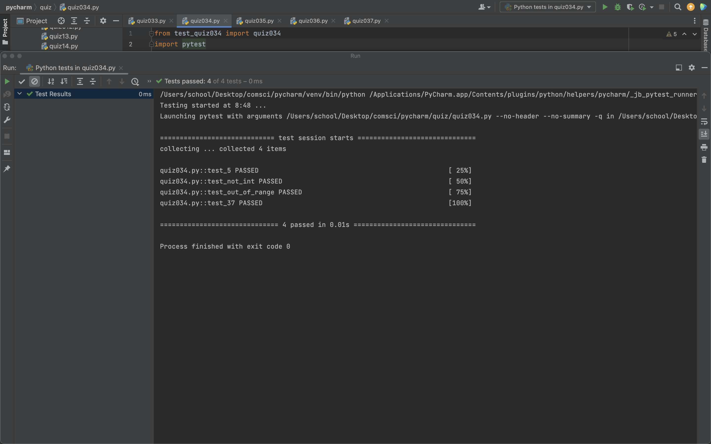
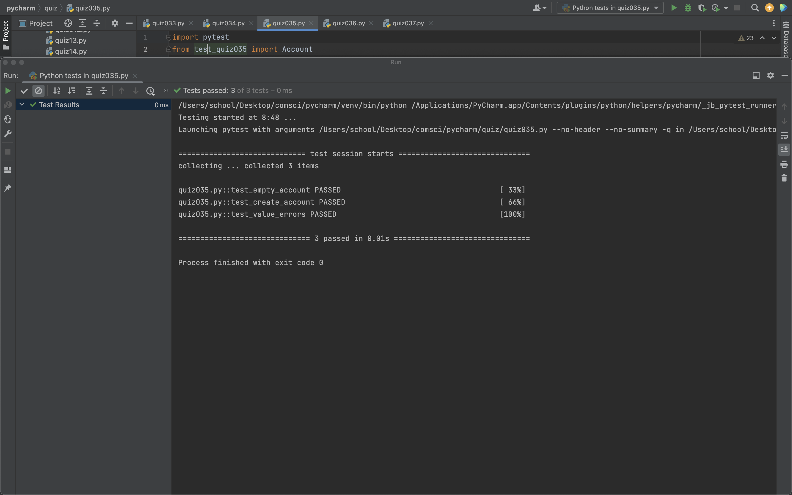
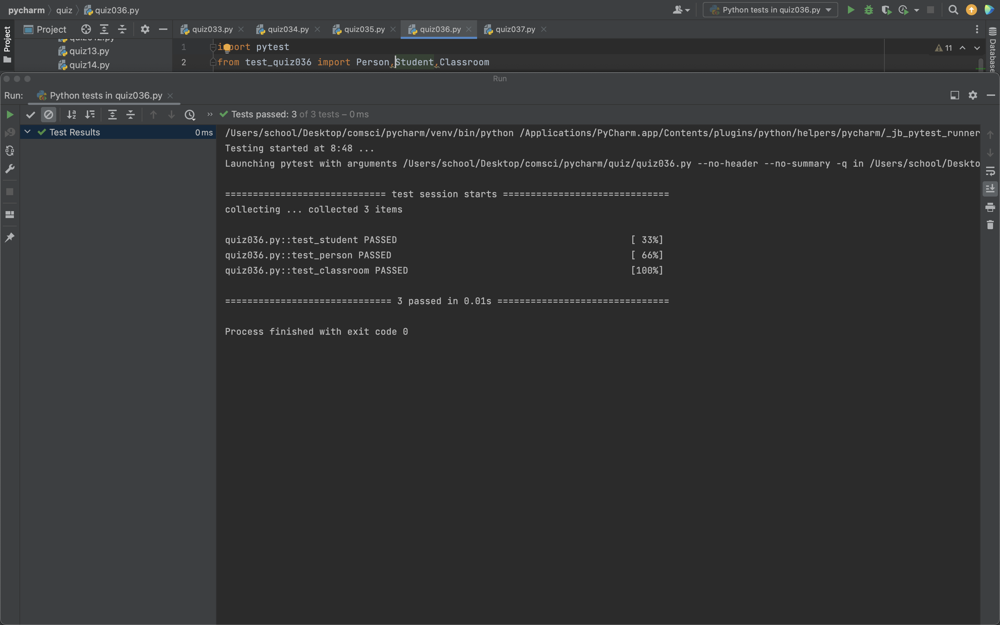

# 33
## main
```.py
from test_quiz033 import mystery
import pytest

def test_empty_lists():
  assert mystery([], []) == []

def test_one_common_element():
  assert mystery([1, 2, 3], [3, 4, 5]) == [3]

def test_multiple_common_elements():
  assert mystery([1, 2, 3, 4], [3, 4, 5, 6]) == [3, 4]
```
## test code
```.py
def mystery(list1,list2):
    output = []
    for i in list1:
        for x in list2:
            if i == x:
                output.append(i)
    return (output)
```


# 34
## main
```.py
from test_quiz034 import quiz034
import pytest

def test_5():
    assert quiz034(5).romannum() == 'V'

def test_not_int():
    with pytest.raises(TypeError):
        assert quiz034("a").romannum()
def test_out_of_range():
    with pytest.raises(ValueError):
        assert quiz034(101).romannum()
def test_37():
    assert quiz034(37).romannum() == 'XXXVII'
```
## test code
```.py
class quiz034():
    def __init__(self, num):
        self.num = num

    def romannum(self):
        roma = {100: 'C', 90: 'XC', 50: 'L', 40: 'XL', 10: 'X', 9: 'IX', 5: 'V', 4: 'IV', 1: 'I'}
        result = ''
        if self.num < 1 or self.num > 100:
            raise ValueError("Number must be between 1 and 100")
        if not isinstance(self.num, int):
            raise TypeError("Number must be an integer")
        while self.num > 0:
            for i in roma.keys():
                if self.num>=i:
                    result+=roma[i]
                    self.num-=i
                    break
        return result
```



# 35
## main
```.py
import pytest
from test_quiz035 import Account

def test_empty_account():
    bk = Account(0,'','',[900,11324,5])
    assert bk.balance == 0
    assert bk.holder_name == ""
    assert bk.holder_email == ""
    assert isinstance(bk.number, list)
    number = bk.get_account_no().split("-")
    assert  len(number)==3 and len(number[0])==3 and len(number[1])==5 and len(number[2])==1

def test_create_account():
    bk = Account(0,'','',[900,11324,5])
    assert bk.get_balance() == 0
    assert bk.set_holder_name(name="Bob") == "Name set to Bob"
    assert bk.set_holder_email(email="bob@company.xyz") == "Holder's email set to bob@company.xyz"
    assert bk.deposit(amount=100) == "New balance: 100 USD"
    assert bk.get_balance() == 100


def test_value_errors():
    bk = Account(0,'','',[900,11324,5])
    with pytest.raises(ValueError):
        bk.set_holder_email(email="bob@bob@bob")
        bk.set_holder_name(name=["Bob"])
        bk.set_holder_name(name=100)
```
## test code
```.py
class Account:
    def __init__(self,balance,holder_name,holder_email,number):
        self.balance = 0
        self.holder_name = ''
        self.holder_email = ''
        self.number = [900,11324,5]

    def get_account_no(self):
        return f"{self.number[0]}-{self.number[1]}-{self.number[2]}"

    def set_holder_name(self,name):
        if not isinstance(name,str):
            raise ValueError("Must be a string")
        else:
            self.holder_name = name
        return f"Name set to {name}"

    def set_holder_email(self, email: str) -> str:
        if not isinstance(email, str):
            raise ValueError("Email must be a string")

        else:
            self.holder_email = email
        return f"Holder's email set to {email}"

    def get_balance(self) -> int:
        return self.balance

    def deposit(self, amount: int) -> int:
        self.balance += amount
        return f"New balance: {self.balance} USD"

```


# 36
```.py
import pytest
from test_quiz036 import Person,Student,Classroom


def test_student():
    student = Student("John", 20,90)
    assert student.get_name() == "John"
    assert student.get_age() == 20
    assert student.get_grade() == 90
    with pytest.raises(ValueError):
        student = Student(123, 20,90)
        student.get_name()

def test_person():
    person = Person("John", 20)
    assert person.get_name() == "John"
    assert person.get_age() == 20
    with pytest.raises(ValueError):
        person2 = Person(123, "John")
        person2.get_name()
        person2.get_age()

def test_classroom():
    classroom = Classroom()
    student1 = Student("John", 20,90)
    student2 = Student("Jane", 21,80)
    student3 = Student("Jack", 22,70)
    classroom.add_student(student1)
    classroom.add_student(student2)
    assert classroom.get_average_score() == (90+80)/2
    classroom.remove_student(student1)
    assert classroom.get_average_score() == 80
    with pytest.raises(ValueError):
        classroom.remove_student(student3)
        classroom.get_average_score()
    with pytest.raises(ValueError):
        classroom.remove_student(student1)
        classroom.remove_student(student2)
        classroom.get_average_score()
```
## test code
```.py
class Person:
    def __init__(self, name, age):
        #print("Created Person")
        self.name = name
        self.age = age
    def get_name(self):
        if not isinstance(self.name, str):
            raise ValueError("Name must be a string")
        return self.name

    def get_age(self):
        if not isinstance(self.age, int):
            raise ValueError("Age must be an integer")
        return self.age


class Student(Person):
    def __init__(self,name,age,grade):
        super().__init__(name,age)
        #print("Created Student")
        self.name = name
        self.age = age
        self.grade = grade
    def get_grade(self):
        return self.grade

class Classroom():
    def __init__(self):
        self.students = []

    def add_student(self,student:Student):
        self.students.append(student)

    def remove_student(self,student:Student):
        if student not in self.students:
            raise ValueError("Student not in classroom")
        self.students.remove(student)

    def get_average_score(self):
        if len(self.students) == 0:
            raise ValueError("Classroom is empty")
        total = 0
        for student in self.students:
            total += student.get_grade()
        return total/len(self.students)
```

# 37
## test code
```.py
class compoundinterest():
    def __init__(self,principle,rate,year):
        self.principle = principle
        self.rate = rate
        self.year = year

class AccountingProgram:
    def __init__(self):
        self.compound = compoundinterest(0,0,0)
    def set_principal(self,principal):
        if principal <= 0:
            raise ValueError("Principal should be greater than zero")
        self.compound.principal = principal
        return f"Principal set to {self.compound.principal}"

    def set_rate(self,rate):
        if rate <= 0:
            raise ValueError("Interest rate should be greater than zero")
        self.compound.rate = rate
        return f"Rate set to {self.compound.rate}"

    def set_years(self, year):
        if year <= 0:
            raise ValueError("Years should be greater than zero")
        self.compound.year = year
        return f"Year set to {self.compound.year}"

    def calculate_interest(self):
        temp = self.compound.principal*(1+self.compound.rate)**self.compound.year
        format_float = "{:.2f}".format(temp)
        return float(format_float)
```


# 38
```.py
import random
import matplotlib.pyplot as plt
class coordinate:
    def __init__(self,x,y):
        self.x = x
        self.y = y

    def __repr__(self)->str:
        return f"[Coordinate Object] x:{self.x}, y:{self.y}"

class city:
    def __init__(self,name:str, location:coordinate):
        self.name = name
        self.location = location

    def __repr__(self)->str:
        return f"[City Object] City {self.name} is located at {self.location}"

    def distance(self, cityB):
        xa, ya = self.location.x, self.location.y
        xb, yb = cityB.location.x, cityB.location.y
        d = ((xa-xb)**2 + (ya-yb)**2)**(1/2)
        return d

class country:
    def __init__(self, name:str):
        self.name = name
        self.cities = []

    def add_city(self, new_city:city):
        self.cities.append(new_city)


cities_in_japan = ["Tokyo","Kagoshima","Fukuoka","Osaka","Nagoya","Sapporo","Kyoto","Hiroshima","Naha","Kobe","Karuizawa"]

point1 = coordinate(x=5,y=5)
tokyo = city(name = "Tokyo", location = point1)
kyoto = city(name = "Kyoto", location = coordinate(x=10,y=10))
Japan = country(name="japan")


for name in cities_in_japan:
    x_ran = random.randint(0, 100)
    y_ran = random.randint(0, 100)
    rand_loc = coordinate(x_ran, y_ran)
    ct = city(name = name, location=rand_loc)
    Japan.add_city(ct)
print(Japan)


for i in Japan.cities:
    x = i.location.x
    y = i.location.y
    plt.text (x,y,i.name)
    plt.scatter(x,y)
plt.show() 
```


# 39
## kv file
```.py
Screen:
    size:500,500
    MDBoxLayout:
        size_hint:.7,.3
        orientation:'horizontal'
        pos_hint:{'center_x':.5,'center_y':.5}
        md_bg_color:0,0.4,1,.25
        MDLabel:
            id: count
            halign:'center'
            text:'Count: 0'
            font_size:'34pt'
            size_hint:.5,1
            color:1,0,0,1
        MDRaisedButton:
            text: 'Add +1'
            font_size:'34pt'
            size_hint:.5,1
            md_bg_color:0,.1,0.35,1
            on_press:
                app.add()
```
## code
```.py
from kivymd.app import MDApp

class quiz039(MDApp):
    def __init__(self, **kwargs):
        super().__init__(**kwargs)
        self.count = 0

    def built(self):
        return


    def add(self):
        if self.count < 15:
            self.count += 1
            self.root.ids.count.text = f'Count: {self.count}'


m = quiz039()
m.run()
```


# 40
## kv file
```.py
MDScreen:
    size:500,500
    MDBoxLayout:
        id: main_screen
        orientation:"vertical"
        md_bg_color: "FFFFFF"
        MDLabel:
            id:name
            text: "Masamu"
            halign: "center"
            font_style: "H2"
            theme_text_color: "Custom"
            text_color: 0, 0, 0, 1
            pos_hint: {"center_x": .5, "center_y": .5}
        MDRaisedButton:
            id: button
            text: "Dark Mode"
            pos_hint: {"center_x": 0.06, "center_y": 0.1}
            on_release:
                app.switch()
```
## code
```.py
from kivymd.app import MDApp
class Quiz040(MDApp):
    def __init__(self, **kwargs):
        super().__init__(**kwargs)
    def build(self):
        return
    def switch(self):
        print(self.root.ids.main_screen.md_bg_color)
        if self.root.ids.main_screen.md_bg_color == [1.0, 1.0, 1.0, 1.0]:
            self.root.ids.main_screen.md_bg_color = "000000"
            self.root.ids.button.text_color = 1,1,1,1
            self.root.ids.name.text_color = 1, 1, 1, 1
            self.root.ids.button.text = "Light Mode"
        else:
            self.root.ids.main_screen.md_bg_color = "FFFFFF"
            self.root.ids.button.text_color = 0,0,0,1
            self.root.ids.name.text_color = 0, 0, 0, 1
            self.root.ids.button.text = "Dark Mode"

test = Quiz040()
test.run()
```


